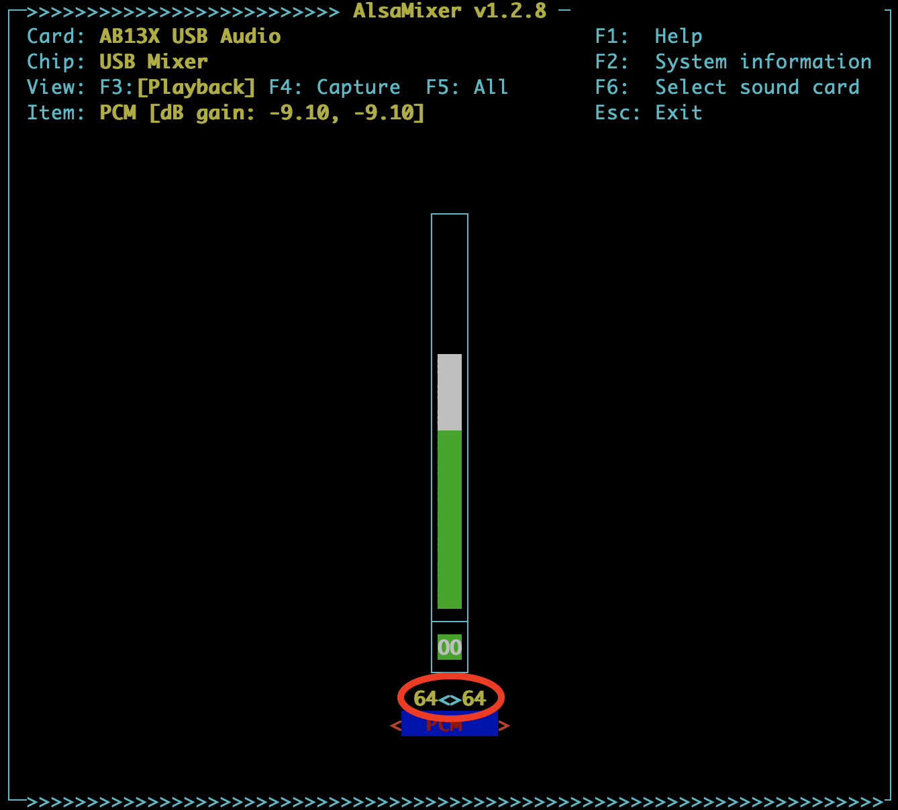

# sdr-enthusiasts/docker-aprs-tracker

Table of Contents

- [sdr-enthusiasts/docker-aprs-tracker](#sdr-enthusiastsdocker-aprs-tracker)
  - [Introduction](#introduction)
  - [Prerequisites](#prerequisites)
  - [Multi Architecture Support](#multi-architecture-support)
  - [Software Installation](#software-installation)
    - [Base, barebones Linux image](#base-barebones-linux-image)
    - [Creation of a new non-root user](#creation-of-a-new-non-root-user)
    - [Installation of Docker](#installation-of-docker)
    - [Preparing your system for use with your container](#preparing-your-system-for-use-with-your-container)
    - [Adding your GPS to the `udev` rules](#adding-your-gps-to-the-udev-rules)
    - [Downloading a template `docker-compose.yml` config file](#downloading-a-template-docker-composeyml-config-file)
    - [Configuration of your data](#configuration-of-your-data)
      - [MUST CHANGE parameters](#must-change-parameters)
      - [OPTIONAL parameters](#optional-parameters)
      - [OTHER parameters](#other-parameters)
  - [Tuning the audio interface](#tuning-the-audio-interface)
  - [Hardware](#hardware)
  - [Logging](#logging)
  - [Acknowledgements](#acknowledgements)
  - [Getting Help](#getting-help)
  - [Summary of License Terms](#summary-of-license-terms)

Join us on Discord - [](https://discord.gg/sTf9uYF)

## Introduction

Docker container for a mobile / stand-alone APRS tracker. Contains:

- [WB2OSZ's excellent APRS software TNC "DireWolf"](https://github.com/wb2osz/direwolf/)
- GPSD for receiving location information from a GPS dongle and for maintaining the device time
- Chrony for setting the device time

The maturity of the container is low. This means that there will probably be bugs, missing features, etc. You should expect frequent software updates and frequent new container images.

## Prerequisites

## Multi Architecture Support

Currently, this image should pull and run on the following architectures:

- `arm32v7`, `armv7l`, `armhf`: ARMv7 32-bit (Raspberry Pi 2/3/4 32-bit, Odroid HC1/HC2/XU4)
- `arm64`, `aarch64`: ARMv8 64-bit (Raspberry Pi 3B+/4B 64-bit OSes, DietPi, LePotato, OrangePi, etc)
- `amd64`, `x86_64`: X86 64-bit Linux (Linux PC)

Other architectures (`i386`: Windows, Mac; `armel`, `armv6`: Raspberry PiZero / 1) are not currently supported due to incompatibility with the S6 container manager we use.

## Software Installation

If you already have a device with Linux running, you can jump straight to one of these two sections:

- [Installation of Docker](#installation-of-docker)
- [Downloading a template `docker-compose.yml` config file](#downloading-a-template-docker-composeyml-config-file)

If you need help installing Linux, read on...

### Base, barebones Linux image

- Start with a minimalist Debian image that works for your hardware device. Personally, I like [DietPi](https://dietpi.com/), but in the absence of this, you can use Raspberry Pi OS (lite) or a standard Debian build. Make sure to pick one that is as barebones as possible; no need for Desktop applications, etc.
- Burn the image to a SD card, and go through the initial setup

### Creation of a new non-root user

- While setting things up, make sure you are connected to the internet!
- If your Linux distribution doesn't do so, please create a non-root user account, for example with `sudo adduser aprs` . (We're using username `aprs`, but you can change this to your liking). Note -- if you use DietPi, the system will create a default user `dietpi`. You can use this account instead of creating a new user.
- Make sure that the user `aprs` is set up for `sudo` access; see the code snippet below. (If appropriate, change `aprs` to `dietpi` or whatever the username is you are using)
- then log out from the `root` account and log back in with the username and password you just created.

```bash
sudo usermod -aG sudo aprs  # this adds the user to the sudo group
echo "aprs ALL=(ALL) NOPASSWD:ALL" | sudo tee /etc/sudoers.d/90-aprs-privileges >/dev/null
sudo chmod 0440 /etc/sudoers.d/90-aprs-privileges
```

Then you can set the system's timezone with this command (follow the instructions on the screen):

```bash
sudo dpkg-reconfigure tzdata
```

### Installation of Docker

Once you are logged in as user `aprs`, you are ready to install Docker. Use the following commands; you can copy and paste them all at once, or paste them line by line:

```bash
# First download the docker installation script and run it:
wget -q https://raw.githubusercontent.com/sdr-enthusiasts/docker-install/main/docker-install.sh
chmod +x docker-install.sh
./docker-install.sh no-chrony
rm -f ./docker-install.sh
```

### Preparing your system for use with your container

Next, let's make sure that there's no NTP, GPSD or Time Sync client installed on your system because these will interfere with the docker container. The docker container will use the connected GPS to update the system time.
You can ignore any error messages like "Failed to disable unit: Unit file xxx.service does not exist". These error messages simply mean that your system didn't have the service to begin with.

Then we will put a `udev` rule in place that ensures that your USB/Serial GPS always is mapped to `/dev/gps`. Right now, it has a limited set of GPS models; see below on how to add yours if you have a different model.

```bash
# Remove any system services that may interfere with the container.
# The container will take care of setting the system time, so we don't need these services on the host
sudo systemctl disable systemd-timesyncd -q --now
sudo systemctl disable chrony -q --now
sudo systemctl disable ntpd -q --now
sudo systemctl disable gpsd -q --now

# Now let's add some udev rules so your GPS data is always available at /dev/gps
# Then we trigger udevadm to read and re-apply all rules
sudo mkdir -p -m 755 /etc/udev/rules.d/
sudo wget -q https://raw.githubusercontent.com/sdr-enthusiasts/docker-aprs-tracker/main/assets/90-gps.rules -o /etc/udev/rules.d/90-gps.rules
sudo udevadm trigger
```

### Adding your GPS to the `udev` rules

At this moment, we only have a limited set of Ublox GPS devices in our mapping ruleset. It's easy to add yours if you have a different one:

- Connect your USB GPS to the board
- Log in to your board, and give this command: `lsusb`. Now a list of devices is shown. Identify your GPS device in that list. For example:

```text
Bus 001 Device 021: ID 1546:01a8 U-Blox AG [u-blox 8]
```

- Note the number after the ID. In our case, `1546` is the Vendor ID and `01a8` is the Product ID
- Now provide the following two commands. Put in the correct Vendor and Product IDs in the string below

```bash
echo 'ACTION=="add", ATTRS{idVendor}=="1546", ATTRS{idProduct}=="1102", SYMLINK+="gps" MODE="0666"' | sudo tee -a /etc/udev/rules.d/90-gps.rules
sudo udevadm trigger
```

Give it a few seconds, and then check that there's a link called `gps` in your `/dev/` directory:

```bash
$ ls -als /dev/gps*
0 lrwxrwxrwx 1 root root 7 Nov 18 23:20 /dev/gps -> ttyACM0
$
```

### Downloading a template `docker-compose.yml` config file

Now let's download a basic the docker-compose.yml file:

```bash
sudo mkdir -p -m 777 /opt/aprs
cd /opt/aprs
wget https://raw.githubusercontent.com/sdr-enthusiasts/docker-aprs-tracker/main/docker-compose.yml
```

### Configuration of your data

The configuration of your data is done entirely through "environment variables" in the `docker-compose.yml` file. Edit this file:

```bash
cd /opt/aprs
nano docker-compose.yml
```

Most of the data can stay the same. Here are the parameters that you can configure in the `environment:` section, categorized by "MUST CHANGE", "OPTIONAL", and "PROBABLY WON'T EVER NEED TO CHANGE".

Please be aware that the document is in `yaml` format. This format determines the "level" of the directive by the spacing in front of the line. BE VERY CAREFUL NOT TO MESS UP SPACING. Do not replace spaces by tabs, etc. This is the largest source of errors we come across by new users.

#### MUST CHANGE parameters

You MUST set these parameters. Without them, DireWolf will not work.

| Environment Variable | Purpose                         | Default |
| -------------------- | ------------------------------- | ------- |
| `MYCALL` | Set the callsign and suffix used in APRS broadcasts, for example `AA0ZZ-10` | Unset |

#### OPTIONAL parameters

For these parameters, the default values are generally good as a starting point, but you may have to adapt them to your situation.

| Environment Variable | Purpose                         | Default |
| -------------------- | ------------------------------- | ------- |
| `AUDIOCARD` | The number of the "audiocard" of your soundcard. If unset, the system will try to detect the value automatically. If this doesn't work, you may have to set it manually \* | Unset |
| `SUBDEVICE` | The number of the "subdevice" of your soundcard. If unset, the system will try to detect the value automatically. If this doesn't work, you may have to set it manually \* | Unset |
| `AUDIOLEVEL_RX` | The audio level of the input of your soundcard (for reception), in percent (`0`=off; `100`=maximum) \*\* | `90` (%) |
| `AUDIOLEVEL_TX` | The audio level of the output of your soundcard (for transmission), in percent (`0`=off; `100`=maximum) \*\* | `50` (%) |
| `SYMBOL` | The symbol of your vehicle in the tracking broadcast. We strongly suggest using a (partial) description from [this list](https://github.com/nwdigitalradio/direwolf/blob/master/symbols-new.txt) rather than using the 2-character value. | `"normal car"` |
| `OVERLAY` | Single letter or number that is overlaid on top of your vehicle symbol | Unset |
| `VERBOSE` | If set to `yes`/`on`/`1`/`true`, produce more verbose output | Unset |
| `DW_DEBUG` | Sets debug verbosity for DireWolf. For accepted values, see `docker exec -it direwolf --help` | Unset |
| `DW_EXTRA_CMDLINEARGS` | Any extra command line arguments you want to pass to DireWolf | Unset |
| `DW_TB_COMMENT` | Any comment text you want to add to your Tracker Beacon transmissions | Unset |

\* If the automatic setting doesn't work, you can show which audio devices, cards and subdevices are available on your system with the following command:

```bash
$ docker exec -it aprs arecord --list-devices

**** List of CAPTURE Hardware Devices ****
card 0: Device [USB PnP Sound Device], device 0: USB Audio [USB Audio]
  Subdevices: 1/1
  Subdevice #0: subdevice #0
```

In this case, we should use `AUDIOCARD=0` and `SUBDEVICE=0`.

\*\* The container tries to use the `Speaker Playback Switch` / `PCM Playback Switch` and `Speaker Playback Volume` / `PCM Playback Volume` capabilities of your soundcard. If this doesn't work, please open an [issue](https://github.com/sdr-enthusiasts/docker-aprs-tracker/issues) and tell us what the equivalent capability of your sound card is called. We can add this within a reasonably short turn around time.

#### OTHER parameters

The default values for these parameters are almost always such that they do not need changing, but you may have to set them to fit your particular situation if you are using a non-standard setup.

| Environment Variable | Purpose                         | Default |
| -------------------- | ------------------------------- | ------- |
| `DWCONFIGFILE:` | Location of the `direwolf.conf` file | `/run/direwolf/direwolf.conf` |
| `VIA` | `VIA` parameter for beacon transmissions. See DireWolf documentation for exact definition | `WIDE1-1,WIDE2-1` |
| `SMARTBEACONING` | `SMARTBEACONING` parameter for beacon transmissions. See DireWolf documentation for exact definition | `70 1:00 5: 5:00 0:15 30 255` |
| `DW_EXTRA_CONFIGS` | Additional parameters to be added or changed in the `direwolf.conf` file. See format below. | Unset |

The `DW_EXTRA_CONFIGS` parameter can be used to add or change additional parameters in your `direwolf.conf` file. You can set this parameter as follows:

```yaml
...
environment:
    DW_EXTRA_CONFIGS=
       PARAM1 value string "here";
       PARAM2 "";
       uncomment:PARAM3;
       comment:PARAM4;
       add:PARAM5 value string here
...
```

In this case:

- `PARAM1` is uncommented (if needed) and replaced with `value string "here"` (replacing any existing values if they exist)
- `PARAM2` is uncommented (if needed) and replaced with no value string (any existing values are removed)
- `PARAM3` is uncommented (if needed) and leaving any existing value string in place
- `PARAM4` is commented out
- `PARAM5` is added to the document regardless of the existence of the parameter. You can use this to add the same parameter multiple times

## Tuning the audio interface

I have found that tuning the audio interface in order to properly send and receive signals is probably the hardest part of making things work. Here are some hints (they will be updated as my experience progresses).

- I am using a USB soundcard. From a software compatibility point of view, I have found both [this](https://a.co/d/1Q3t2Rh) and [this](https://a.co/d/axRJy1E) one works, but don't let yourself be limited
  - To check if the software is compatible, start your container and do `docker exec -it aprs amixer -c 0 controls`. You should see at least these four elements:
    - 'PCM Playback Switch' or 'Speaker Playback Switch'
    - 'PCM Playback Volume' or 'Speaker Playback Volume'
    - 'Mic Capture Switch'
    - 'Mic Capture Volume'
  - If your Playback Switch and Playback Volume is named differently, please file an [issue](https://github.com/sdr-enthusiasts/docker-aprs-tracker/issues), tell us the exact nomenclature, and we will do our best to add it as soon as possible
- I am using a BTECH APRS-K2 cable to connect the soundcard to a Baofeng UV-5R device
- On the handheld:
  - turn up the volume to maximum
  - in the menu:
    - set `0 - SQL` to `1`
    - set `4 - VOX` to `9`
    - set `5 - WN` to `narrow`
    - switch off all extra transmissions, power-saver, roger-beeps, tones, lights, etc. The menu items I switched off were `3 - SAVE`, `6 - ABR`, `7 - TDR`, `8 - BEEP`, `10 - R-DCS`, `12 - T-DCS`, `16 - DTMFST`, `19 - PTT-ID`, `23 - BCL`, `25 - SFT-D`, `30 - RX-LED`, `35 - STE`, `36 - RP_STE`, `37 - RPT_RL`, and `39 - ROGER`
    - tune to `144.390` (North America frequency; the frequencies for other regions can be found [here](https://www.sigidwiki.com/wiki/Automatic_Packet_Reporting_System_(APRS)#Frequencies))
    - lock the device so you don't accidentally change the frequency or settings
- For audio RECEPTION on your APRS tracker container:
  - Start with  `AUDIOLEVEL_RX=90` (which is the default)
  - Monitor the container logs with `docker logs -f aprs`. After a while, you should see entries like the one below. Take note of `audio level = 57(xx/xx)`; if the value is generally between 40-80, your reception is good.

```text
[2023-11-16 08:56:53.100][direwolf] Digipeater W1XM audio level = 57(18/33)   [NONE]   |________
```

- For audio TRANSMISSION with your APRS tracker container:
  - Unless you have a lot of fancy equipment, you will need a second receiver (handheld is OK) on the same APRS frequency
  - Open two login sessions to your SBC:
    - Session 1: `docker exec -it aprs alsamixer` -- this will open the semi-graphical `alsamixer`
    - Session 2: `docker exec -it aprs bash -c "pkill direwolf && direwolf -x"` -- this will start transmitting audio tones. If the session finishes before you are done tuning, simply repeat this command.
  - In the `alsamixer`, make sure you select the correct audio card and are in `Playback` view
  - While listening to the audio tones on your secondary receiver, increase or decrease the volume in the `alsamixer`
  - Once the audio sounds acceptable, please note the audio level. In the screenshot below, it's `64`. Your number may vary.
  - You can now exit `alsamixer` and press `CTRL-c` to exit Direwolf testing.
  - Add `- AUDIOLEVEL_TX=64` (replace `64` with your number) to the `environment:` section of your `docker-compose.yml` file
  - Further experimentation may cause you to have to increase the `TXDELAY` (time in 10 msec units between the start of the transmission and the start of actually sending data). You can do this by adding `- DW_EXTRA_CONFIGS=TXDELAY=30` (`30` = 300 msec) to the `environment:` section of your `docker-compose.yml` file

After making and saving any changes to the `docker-compose.yml` file, don't forget to restart the container with `cd /opt/aprs && docker compose up -d`
`


## Hardware

Nothing is set in stone, and I have been experimenting with a number of different configurations.

- SBC: I've tried Raspberry Pi 3B+, Raspberry Pi 4B, and LePotato. They all function well; the Raspi4 is definitely overkill
- Soundcard: I have used [this AB13X based dongle](https://a.co/d/j5zJBzk), and [this C-Media based dongle](https://a.co/d/4ZmEogu). Both work fine. However... read on below
- Radio: Baofeng handheld, any of the UV-5R series devices. They work OK
- GPS: [this VK161 based "GPS Mouse"](https://a.co/d/0DfSNQy)
- Interface Cable: [BTech APRS-K1](https://a.co/d/cDgS5KW). (Read on below)

This works *somewhat*. The circuit lacks a much needed PTT and the Vox circuit creates a very long transmission tail that will make you miss any repeated signals, and it will probably cause many repeaters to transmit over your tail. [No good, Mr. George!](https://youtu.be/DUhKXwdLjrs)

The solution as noted by many people is to use a CM108 based sound card and add a PTT connector to it. There is a [website](https://github.com/skuep/AIOC) that creates a all-in-one solution with a soundcard that is directly pluggable into any Kenwood-standard TX/RX audio connector, including Baofeng devives. You can order these devices assembled from [na6d.com](https://na6d.com/) (US shipping only). This device does need to get programmed (instruction on the [website](https://github.com/skuep/AIOC)) but that looks like an easy thing to do. I will update this once I receive the gadget.
This will replace the need for a sound card and a APRS-K1 cable for more or less the same price.

## Logging

- All processes are logged to the container's stdout, and can be viewed with `docker logs [-f] container`.

## Acknowledgements

Without the help, advice, testing, and kicking the tires of these people, things wouldn't have happened:

## Getting Help

You can [log an issue](https://github.com/sdr-enthusiasts/docker-direwolf/issues) on the project's GitHub.
I also have a [Discord channel](https://discord.gg/sTf9uYF), feel free to [join](https://discord.gg/sTf9uYF) and converse. The #general channel is appropriate for conversations about this package.

## Summary of License Terms

This container is Copyright (C) 2023, Ramon F. Kolb (kx1t)

This program is free software: you can redistribute it and/or modify
it under the terms of the GNU General Public License version 3 as
published by the Free Software Foundation.

This program is distributed in the hope that it will be useful,
but WITHOUT ANY WARRANTY; without even the implied warranty of
MERCHANTABILITY or FITNESS FOR A PARTICULAR PURPOSE.  See the
GNU General Public License for more details.

You should have received a copy of the GNU General Public License
along with this program.  If not, see <https://www.gnu.org/licenses/>.
